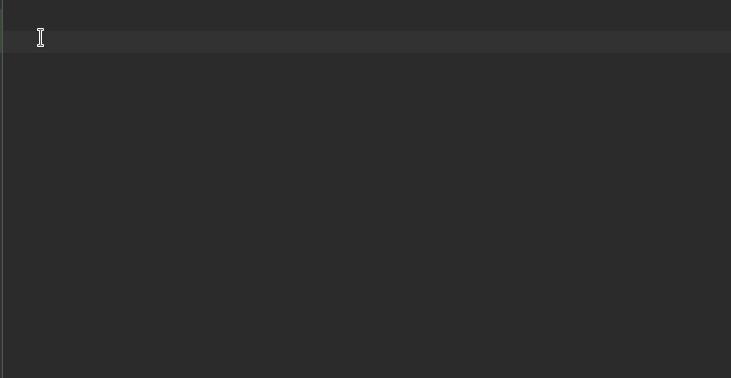

# pynetbox-stubs

Project that contains Python stub files for pynetbox in order to allow type checking 
code that uses pynetbox with [mypy](http://mypy-lang.org/)

# installation

```shell
pip install pynetbox-stubs
```

# Example

Enables autocompletion: 



# Development

you'll need a local netbox running on port `8080`, then run 

```shell
make openapi.json
python -m venv venv
. venv/bin/activate 
pip install -r requirements.txt
tox -e gen,fixlint
```

## TODOs:

Right now, this project is still unfinished:

* [ ] make stubs for `pynetbox.models.*`
* [ ] `pynetbox.core.query`
* [ ] `pynetbox.core.app.PluginsApp`
* [ ] `POST`, `POST`, `PATCH` parameters
* [ ] Detail routes like `/ipam/ip-ranges/{id}/available-ips/`
